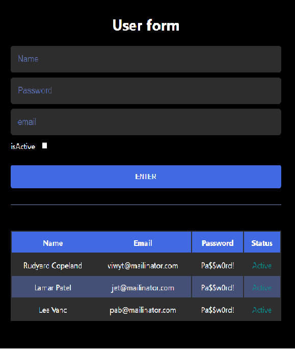

Pizza App
> react-pizaa-app

 ## [Demo](https://brilliant-salamander-26d54f.netlify.app/)

## Tools

A short demo user form validation app without any from tools.

## Development setup

Getting Started with Create React App

This project was bootstrapped with [Create React App](https://github.com/facebook/create-react-app).

## Available Scripts

In the project directory, you can run:

### `npm start`

Runs the app in the development mode.\
Open [http://localhost:3000](http://localhost:3000) to view it in your browser.

The page will reload when you make changes.\
You may also see any lint errors in the console.

